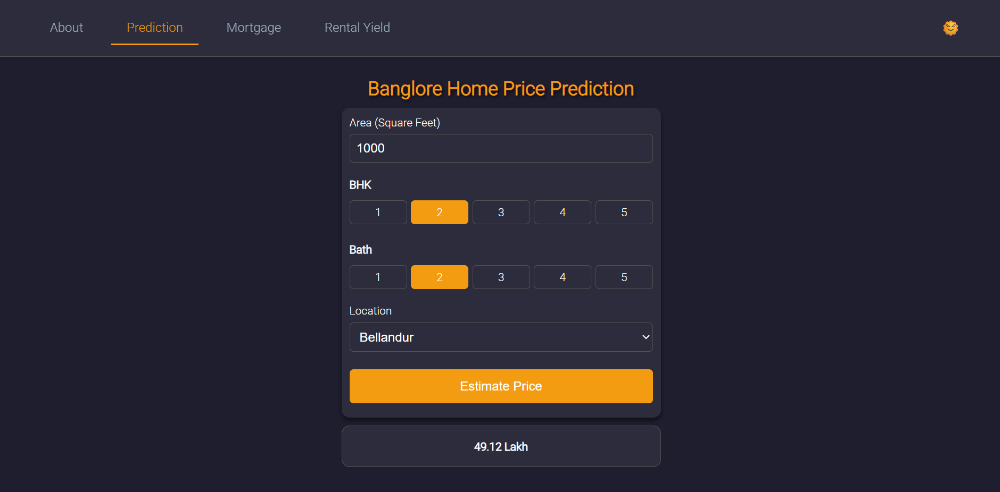
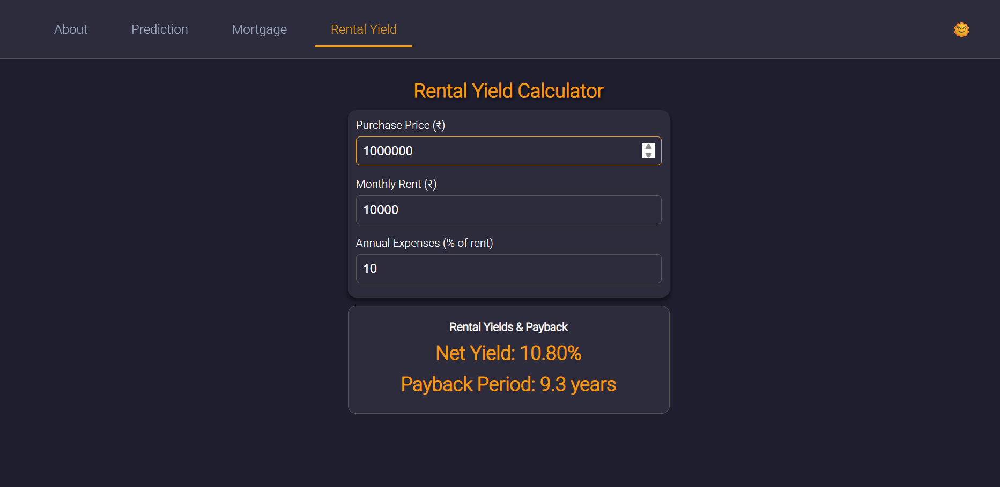
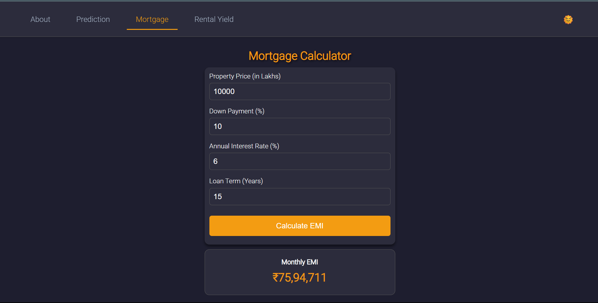

# Real Estate Price Prediction

A **production-ready** web application for predicting real estate prices in Bengaluru using a machine learning model.  

## Table of Contents

- [Demo](#demo)  
- [Features](#features)  
- [Architecture](#architecture)  
- [Tech Stack](#tech-stack)  
- [Installation](#installation)  
- [Usage](#usage)  
- [Project Structure](#project-structure)  
- [Contributing](#contributing)  


## Demo

Explore the live application:  
https://real-estate-price-prediction-0ocn.onrender.com

### Screenshots

#### Price Prediction Interface  


#### Rental Yield Calculator  


#### Mortgage Estimator  



- Predict property sale prices based on location, size, and area
- Calculate expected rental yield for investment analysis  
- Estimate mortgage EMI based on principal, interest rate, and tenure  
- Responsive UI with real-time validations  


## Architecture

The application follows a **client–server** model:

1. **Client (frontend)**  
   - Single-page application built with React  
   - Communicates via REST endpoints for predictions and calculators  

2. **Server (backend)**  
   - Hosts a pre-trained Python ML model (scikit-learn) served via a REST interface  


3. **Deployment**  
   - Dockerized services for both client and server  

 
## Tech Stack

- **Frontend:** React
- **Backend:**  Python (Flask)

  
## Installation

1. **Clone the repository**  
   ```bash
   git clone https://github.com/Krrish-agrawal/Real_Estate_Price_Prediction.git
   cd Real_Estate_Price_Prediction
   ```

2. **Environment Variables**  
   Create a `.env` file in the `server` directory:
   ```env
   PORT=5000
  

3. **Build & Start with Docker Compose**  
   ```bash
   docker-compose up --build
   ```

4. **Access the App**  
   Frontend: http://localhost:3000  
   Backend API: http://localhost:5000/api  

## Usage

- Navigate to the homepage to enter property details and view predicted prices.  
- Switch to the **Rental Yield** tab to evaluate investment returns.  
- Use the **Mortgage Estimator** tab for EMI breakdowns.  
- Data and prediction logs are stored automatically for auditing.  

## Project Structure

```
.
├── client/                  # React frontend
│   ├── public/
│   └── src/
│       ├── components/
│       └── services/
├── server/                  # Backend API
│   ├── controllers/
│   ├── model/
│   ├── routes/
│   └── index.js
├── images/                  # Screenshots
│   ├── mortgage.png
│   ├── price_prediction.png
│   └── rental_yield.png
├── .gitignore
├── docker-compose.yml
└── README.md
```

## Contributing

1. Fork the repository  
2. Create a new branch (`git checkout -b feature/YourFeature`)  
3. Commit your changes (`git commit -m 'Add some feature'`)  
4. Push to the branch (`git push origin feature/YourFeature`)  
5. Open a Pull Request  
